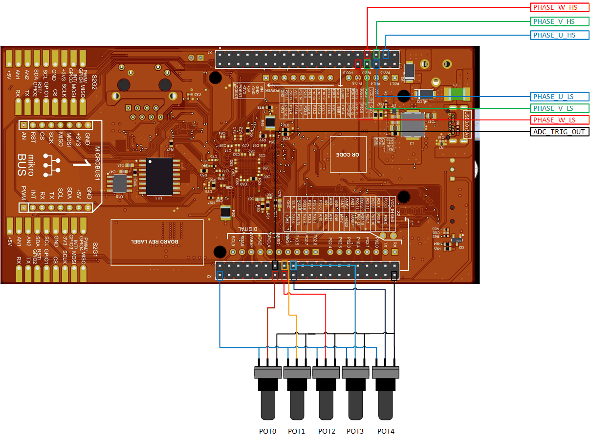

  

# iLLD_TC4D7_LK_ADS_EGTM_ATOM_ADC_TMADC_Multiple_Channels_1 
 
**The ADC TMADC synchronous sampling support on multiple input channels with a single trigger source from EGTM ATOM. The TriCore&trade; is used as a host for the driver.**  

## Device  
The device used in this example is AURIX&trade; TC4D7XP_A-Step_MC_COM.  

## Board  
The board used for testing is the AURIX&trade; TC4D7 Lite Kit (KIT_A3G_TC4D7_LITE).  

## Scope of work  

The Time-Multiplexed Analog-to-Digital Converter (TMADC) synchronous sampling on multiple input channels is triggered with single source from Enhanced Generic Timer Module (EGTM) in-built ARU-Connected Timer Output Module (ATOM). In addition, the states of the 6 pins are controlled by the PWM signals generated by ATOM. All 6 PWM signals are synchronous to each other, center-aligned and with dead-times (positive/negative) for the complementary pairs.

## Introduction  
EGTM is an enhanced instance of the Generic Timer Module (GTM), a universal timer architecture provided by Bosch AE.

The EGTM module is capable of driving different kinds of pulse-width-modulation (PWM) with and without
dead-time. It is optimized for electrical drive applications.

The ARU-connected Timer Output Module (ATOM), which is part of the EGTM, is able to generate complex output signals.

The Clock Management Unit (CMU) is responsible for clock generation of the EGTM. The Configurable Clock Generation Subunit (CFGU) provides eight clock sources for the EEGTM submodules: TIM, TBU, MON and ATOM.

The Time-Multiplexed Analog-to-Digital Converter (TMADC) is based on a Successive Approximation Register (SAR) concept and provides 12-bit analog to digital conversion of up-to 16 external analog input channels using 2 SAR cores supporting a maximum output sample-rate of 4 MSPS.

The following features describe the functionality of the TMADC module:
- Analog supply voltage 5.0 V or 3.3 V
- Reference voltage monitoring support
- Input voltage range from analog reference ground (VAGND) up to analog reference supply voltage (VAREF)
- Each TMADC module supports up to 16 external analog input channels that can get mapped to 2 SAR
cores
- Programmable sampling time on each input channel
- Maximum output data rate up to 4 MSPS
- Flexible trigger source selection
- One shot or continuous conversion modes supported on single or multiple input channels
- Powerful result handling
- Configurable checking against programmable limits
- Service request generation based on result events and error events
- External analog multiplexer control support
- Built-in diagnostic features

More details can be found in User Manual and Data Sheet.

## Hardware setup  
This code example has been developed for the board AURIX&trade; TC4D7 Lite Kit board (KIT_A3G_TC4D7_LITE):

  

## Implementation  

**EGTM configuration** 
   
The *IfxEgtm_Pwm.h* iLLDs provide the EGTM PWM driver to configure required peripheral resources and drive them to produce the PWM waveform and trigger signal for TMADC. The *IfxEgtm_Trigger.h* iLLD provide the EGTM driver to connect trigger signal to TMADC.
The drivers are initialized and driven by the TriCore&trade; core.
  
The *initEgtmAtom()* configuration sequence is the following:
* Initialization of the EGTM Module
* Configuration of the CMU-CLOCK0 for the ATOM usage
* Configuration of the PWM channel groups to produce 3 complementary pair signals
* Configuration of the PWM channel groups to produce trigger for TMADC
* Configuration of the TMADC trigger source (EGTM Cluster 0, ATOM Channel 3)
* Initialization of the drivers  
* To indicate the correct initialization of the EGTM ATOM, the LED (P03.9) is turned on using the iLLD function *IfxPort_setPinModeOutput()*

Following PWM characteristics are enabled/configured with this example:

<table>
    <tbody>
        <tr>
            <td><b>PWM Type</b></td>
            <td>Center Aligned</td>
        </tr>
        <tr>
            <td><b>Frequency</b></td>
            <td>20 kHz</td>
        </tr>
        <tr>
            <td><b>Polarity</b></td>
            <td>Duty-On High</td>
        </tr>
        <tr>
            <td><b>Complementary Output</b></td>
            <td>Enabled (opposite polarity)</td>
        </tr>
        <tr>
            <td><b>DTM enabled</b></td>
            <td>
                <table>
                    <tbody>
                        <tr>
                            <td><b>Channel</b></td>
                            <td><b>Rising Edge</b></td>
                            <td><b>Falling Edge</b></td>
                        </tr>
                        <tr>
                            <td>CH0</td>
                            <td>1uS</td>
                            <td>1uS</td>
                        </tr>
                        <tr>
                            <td>CH1</td>
                            <td>1uS</td>
                            <td>1uS</td>
                        </tr>
                        <tr>
                            <td>CH2</td>
                            <td>1uS</td>
                            <td>1uS</td>
                        </tr>
                    </tbody>
                </table>
            </td>
        </tr>
    </tbody>
</table>

Following PWM characteristics for TMADC trigger are enabled/configured with this example:

<table>
    <tbody>
        <tr>
            <td><b>PWM Type</b></td>
            <td>Edge Aligned</td>
        </tr>
        <tr>
            <td><b>Frequency</b></td>
            <td>20 kHz</td>
        </tr>
        <tr>
            <td><b>Polarity</b></td>
            <td>Duty-On Low</td>
        </tr>
        <tr>
            <td><b>Complementary Output</b></td>
            <td>Disabled</td>
        </tr>
        <tr>
            <td><b>DTM</b></td>
            <td>Disabled</td>
        </tr>
        <tr>
            <td><b>Duty cycle</b></td>
            <td>50 % (TMADC trigger at the middle of the PWM period)</td>
        </tr>
    </tbody>
</table>

The table below provides the mapping between the PWM signal and the Port Pins:  

<table>
    <tbody>
        <tr>
            <td><b>&emsp;PWM Signal</b></td>
            <td><b>&emsp;Pin Mapping</b></td>
        </tr>
        <tr>
            <td>&emsp;PHASE_U_HS</td>
            <td>&emsp;P20.8</td>
        </tr>
        <tr>
            <td>&emsp;PHASE_U_LS</td>
            <td>&emsp;P20.9</td>
        </tr>
        <tr>
            <td>&emsp;PHASE_V_HS</td>
            <td>&emsp;P20.10</td>
        </tr>
        <tr>
            <td>&emsp;PHASE_V_LS</td>
            <td>&emsp;P20.11</td>
        </tr>
        <tr>
            <td>&emsp;PHASE_W_HS</td>
            <td>&emsp;P20.12</td>
        </tr>
        <tr>
            <td>&emsp;PHASE_W_LS</td>
            <td>&emsp;P20.13</td>
        </tr>
        <tr>
            <td>&emsp;ADC_TRIG_OUT</td>
            <td>&emsp;P33.0</td>
        </tr>
    </tbody>
</table>

**EGTM update**   
 
Once the EGTM is configured and started, a duty cycle update is performed every 500ms in the *updateEgtmAtomDuty()* function:

1. Each channel **x** is cyclically modified with 10% increment duty cycle from 0% till 100% using the variable *g_egtmAtom3phInv.dutyCycles[***x***]* 
2. The duty cycle of all channels is then updated at once using the iLLD function *IfxEgtm_Pwm_updateChannelsDutyImmediate()*

** TMADC configuration**

The *IfxAdc_Tmadc.h* iLLDs provide the ADC driver to configure required peripheral resources. The *IfxAdc_Tmadc.h* iLLDs provide the TMADC driver to configure required ADC sub-module resources. ADC drivers are initialized and driven by the TriCore&trade; core.

The *initTMADC()* configuration sequence is the following:
* Enabling of the ADC Module
* Configuration of the TMADC Module 0
* Initialization of the TMADC driver
* Initialization of the TMADC service request configuration register 0
* Initialization of the TMADC channels
* Run of the TMADC Module

Following TMADC characteristics are enabled/configured with this example:

<table>
    <tbody>
        <tr>
            <td><b>TMADC Module</b></td>
            <td>0</td>
        </tr>
        <tr>
            <td><b>TMADC event</b></td>
            <td>Service request on result event</td>
        </tr>
        <tr>
            <td><b>Interrupt provider</b></td>
            <td>TriCore&trade; Core 0</td>
        </tr>
        <tr>
            <td><b>TMADC service request</b></td>
            <td>Service request generation on occurrence of all events</td>
        </tr>
        <tr>
            <td><b>TMADC Channels</b></td>
            <td>
                <table>
                    <tbody>
                        <tr>
                            <td>CH0, one-shot conversion, SAR Core0, Wait-for-Read enabled </td>
                        </tr>
                        <tr>
                            <td>CH1, one-shot conversion, SAR Core0, Wait-for-Read enabled </td>
                        </tr>
                        <tr>
                            <td>CH2, one-shot conversion, SAR Core0, Wait-for-Read enabled </td>
                        </tr>
                        <tr>
                            <td>CH3, one-shot conversion, SAR Core0, Wait-for-Read enabled </td>
                        </tr>
                        <tr>
                            <td>CH4, one-shot conversion, SAR Core0, Wait-for-Read enabled </td>
                        </tr>
                    </tbody>
                </table>
            </td>
        </tr>
        <tr>
            <td><b>Service request result node</b></td>
            <td>Service request 0, each channel</td>
        </tr>
        <tr>
            <td><b>Sampling time</b></td>
            <td>100ns, each channel</td>
        </tr>
            <td><b>TMADC Trigger Source 1 </b></td>
            <td>
                <table>
                    <tbody>
                        <tr>
                            <td>Same for all channels</td>
                        </tr>
                        <tr>
                            <td>Trigger number 36</td>
                        </tr>
                        <tr>
                            <td>Channel conversion request on falling edge</td>
                        </tr>
                    </tbody>
                </table>
            </td>
    </tbody>
</table>

**The TMADC Interrupt Service Routine (ISR)**

The TMADC ISR implemented in this example updates *g_result[x]* variable with new TMADC result value by calling the iLLD function *IfxAdc_Tmadc_readChannelResult()* (iLLD source file *IfxAdc_Tmadc.c*).

## Compiling and programming

Before testing this code example:  
- Power the board through the dedicated power connector 
- Connect the board to the PC through the USB interface
- Build the project using the dedicated Build button  or by right-clicking the project name and selecting "Build Project"
- To flash the device and immediately run the program, click on the dedicated Flash button   

## Run and Test   

Connect the outer pins of a potentiometer POTy (y = 0, 1, 2, 3, 4) to V_UC and GND. Connect the middle pin of the POTy (output) to ANy (y = 0, 1, 2, 3, 4).  
The V_UC, GND and ANy can be found on connector X703.

After code compilation and flashing the device, perform the following:

Add the variable *g_result[y]* to the Watches on the debugger and monitor values while changing the voltage levels, by turning the potentiometers knob (or dial) left and right.

  

The PWM signals can be observed using a logic analyzer or an oscilloscope connected to the pins shown in the picture above.  
The following video shows the generated PWM signals:

<video width="800" height="321" controls>
  <source src="./Images/PWM_Signals_3PH_ADC_Trig.mp4" type="video/mp4"/>
</video>  

Legend:  
D0: PHASE_U_HS  
D1: PHASE_U_LS  
D2: PHASE_V_HS  
D3: PHASE_V_LS  
D4: PHASE_W_HS  
D5: PHASE_W_LS  
D5: ADC_TRIG_OUT  

## References  

AURIX&trade; Development Studio is available online:  
- <https://www.infineon.com/aurixdevelopmentstudio>  
- Use the "Import..." function to get access to more code examples  

More code examples can be found on the GIT repository:  
- <https://github.com/Infineon/AURIX_code_examples>  

For additional trainings, visit our webpage:  
- <https://www.infineon.com/aurix-expert-training>  

For questions and support, use the AURIX&trade; Forum:  
- <https://community.infineon.com/t5/AURIX/bd-p/AURIX> 
