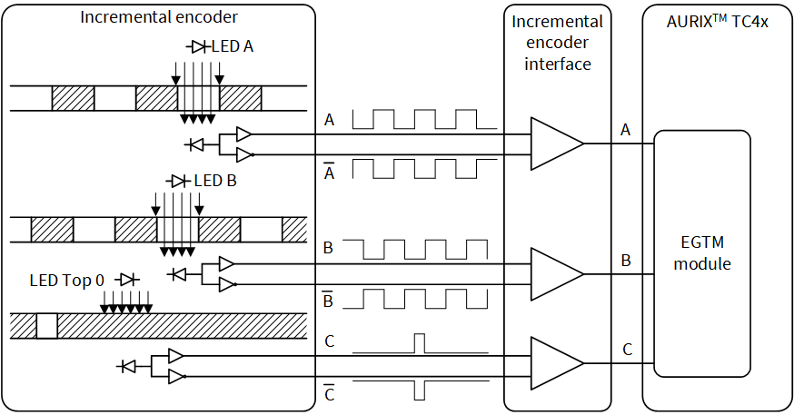
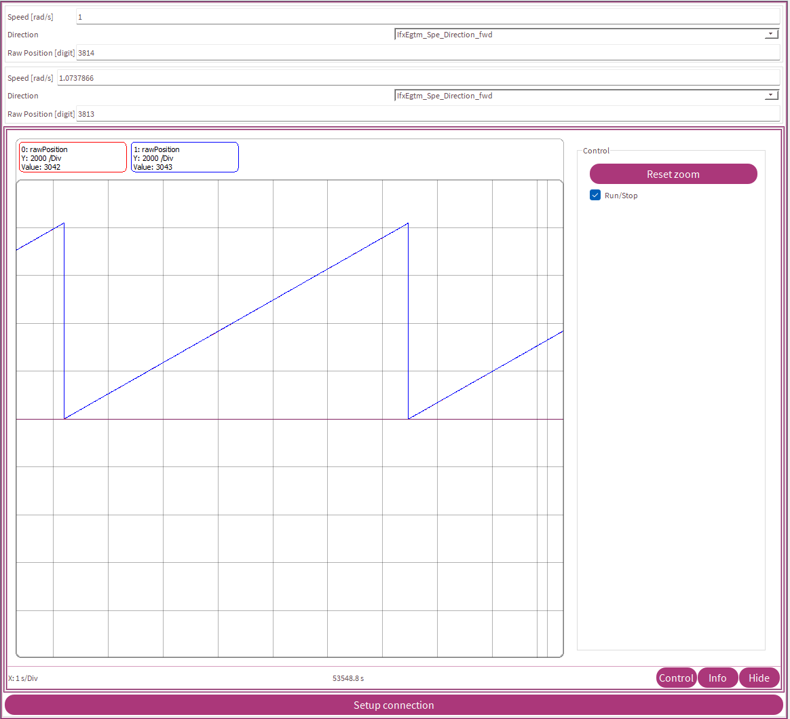

  

# iLLD_TC4D7_LK_ADS_EGTM_Incremental_Encoder_1  
**The EGTM is configured to support incremental encoder. The incremental encoder signals are emulated using GPIOs.**  

## Device  
The device used in this example is AURIX&trade; TC4D7XP_A-Step_MC_COM.  

## Board  
The board used for testing is the AURIX&trade; TC4D7 Lite Kit (KIT_A3G_TC4D7_LITE).  

## Scope of work  

The incremental encoder signals are emulated using GPIOs. Those signals are connected to EGTM TIM0_2 and TIM0_1 inputs. SPE3 block captures encoder A and B signals, while TIM0_3 is used to capture encoder index signal.

## Introduction  

An incremental encoder contains LED emitters, integrated circuits with light detectors and output circuitry. A disk with a markings pattern on its surface rotates between the emitter and detector IC, thus allowing and blocking the light of the emitter from reaching the detector IC. The outputs of the detector IC could be single-ended and differential signals. There are three output signals. Two of them provide a square wave signal with a 90 degree phase shift. The third one generates once per revolution a short pulse for synchronization.

  

The Enhanced Generic Timer Module (EGTM) is a modular timer unit designed to accommodate many timer applications. The Clock Management Unit (CMU) is responsible for clock generation of the EGTM. The Configurable Clock Generation Subunit (CFGU) provides eight clock sources for the following eGTM submodules

- Timer Input Module (TIM),
- Time Base Unit (TBU),
- Monitor Unit (MON),
- Sensor Pattern Evaluation (SPE),
- Timer Output Module (TOM),
- ARU-connected Timer Output Module (ATOM),
- Dead-time Module ( DTM ) and 
- Output Compare Unit ( CMP ).

SPE module is used to evaluate the input patterns and able to count the changes in pattern and determine the direction. For more details about the connection between the SPE to the TIM channels, refer Sensor Pattern Evaluation ( SPE ) sub-chapter in GTM chapter. TIM block in this example is used to detect the rising edge for the encoder index signal.

## Hardware setup  
This code example has been developed for the board TC4D7 Lite Kit board (KIT_A3G_TC4D7_LITE).  

  

## Implementation  

**Configuring EGTM blocks for incremental encoder**

Configuration of the EGTM sub-blocks is done using the function *IfxEgtm_IncrEnc_init()* by the following steps:
- Enable EGTM and setup the required clocks
- Update the driver parameters based on the configuration
- Configure the encoder pins to the corresponding TIM channels and enable the TIM channels
- Configure the valid patterns for the SPE and actual and previous input pattern based on new input pattern
- Enable SPE inputs 0 and 1 and make the TIM selection
- Configure and enable SPE RCMP_IRQ interrupt and enable SPE block
- Configure the EGTM TIM channel and its interrupt related to the pin Z

**Initialize incremental encoder configuration**

- The default parameters for the incremental encoder are initialized using the function *IfxEgtm_IncrEnc_initConfig()*

**Updating the status**

The speed, direction and the rawposition information is updated to the handler using the function *IfxEgtm_IncrEnc_update()* by the following steps:
- The direction information is obtained from the ADIR register bitfield
- The SPE_REV_CNT is read and processed to get the rawposition
- The previous position is tracked for speed calculation

**Note**: The speed is calculated at regular interval based on *speedUpdate* configuration. If this is set to low value, speed calculation will be affected for lower speed.

**Getting rawposition**

The rawposition is obtained by using the function *IfxEgtm_IncrEnc_getRawPosition()*

**Getting direction**

The rawposition is obtained by using the function *IfxEgtm_IncrEnc_getDirection()*

**Getting speed**

The rawposition is obtained by using the function *IfxEgtm_IncrEnc_getSpeed()*

**Handling SPE_REV_CNT overflow**

When the SPE_REV_CNT overflows, it needs to be reload based on the encoder resolution, this is done by calling the function *IfxEgtm_IncrEnc_handleOverflow()*. This needs to be called from the interrupt handler corresponding to the interrupt SPE_RCMP_IRQ

**Handling encoder index signal**

When the encoder index signal (Z) occurs, a rotation is completed and *IfxEgtm_IncrEnc_onZeroIrq* is expected to be called from the TIM channel interrupt configured for the pin Z.

**Configuring EGTM blocks**

Configuration of the EGTM is done once in the function *initEgtmTimer()* by the following steps:
- Initialize an instance of the structure *gtmConfig* with the function *IfxEgtm_IncrEnc_initConfig()*
- Modify *egtmConfig* according to the application needs
- Initialize the Incremental Encoder handle with the function *IfxEgtm_IncrEnc_init()*

The above configuration functions are provided by the header *IfxEgtm_IncrEnc.h*.

**The EGTM SPE Interrupt Service Routine (ISR)**

*interruptSpe()* is implemented for the EGTM SPE ISR to handle overflow of SPE_REV_CNT, *IfxEgtm_IncrEnc_handleOverflow()* is called in this handler

**The EGTM TIM Interrupt Service Routine (ISR)**

The EGTM TIM ISR implemented in this example contains the following using the function *interruptGtm()* does the following
- Increment *g_intCount*
- Increment or decrement numbers of turns by calling the iLLD function *IfxEgtm_IncrEnc_onZeroIrq()* 

## Compiling and programming
Before testing this code example:  
- Power the board through the dedicated power connector 
- Connect the board to the PC through the USB interface
- Build the project using the dedicated Build button  or by right-clicking the project name and selecting "Build Project"
- To flash the device and immediately run the program, click on the dedicated Flash button   

## Run and Test   

After code compilation and flashing the device open OneEye configuration by double clicking on: Libraries/ iLLD_TC4D7_LK_ADS_GTM_Incremental_Encoder_1.OneEye or click on OneEye button within Aurix Development Studio.

Change Speed [rad/s] in control part (requested speed) and observe acquired Speed [rad/s] in Status part. Requested raw position (blue) and acquired position (red) could be observed in Graph.

  

## References  

AURIX&trade; Development Studio is available online:  
- <https://www.infineon.com/aurixdevelopmentstudio>  
- Use the "Import..." function to get access to more code examples  

More code examples can be found on the GIT repository:  
- <https://github.com/Infineon/AURIX_code_examples>  

For additional trainings, visit our webpage:  
- <https://www.infineon.com/aurix-expert-training>  

For questions and support, use the AURIX&trade; Forum:  
- <https://community.infineon.com/t5/AURIX/bd-p/AURIX> 
